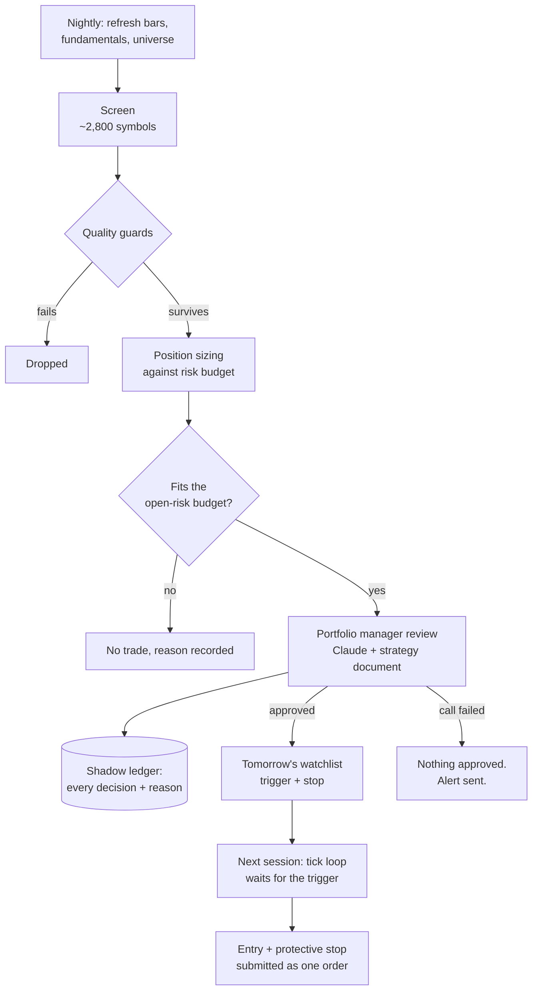

# Claudio

An autonomous equity trading system. Every night it screens the US market, sizes positions
against a written risk budget and has an LLM portfolio manager review the shortlist. The next
day it places orders with Charles Schwab, with the protective stop attached, and reports what
it did by email.

It runs unattended on a Mac mini. I built it to find out whether the things I was being
taught about position sizing and valuation survive contact with a live account.

---

## Status

| | |
|---|---|
| **Account A** | Live. Trades a momentum / value / bounce strategy. |
| **Account B** | Live since September 2026, first trade pending. Trades a conservative, trend-confirmed value strategy. |
| **Tests** | 120, runnable with no keys or broker account |
| **Universe** | ~2,800 US symbols, ~830,000 daily bars |

**I don't publish returns.** The live sample is small enough that any number I quoted
would be noise, and a reader would be right to distrust it. What's below is about how
the system decides, not how it has done.

---

## The daily cycle



Nothing is bought the same day it is found. The screen proposes at night, the review
gate judges, and the next session only acts if price trades up through the trigger. If
it gaps too far past the trigger, the entry is skipped and logged as missed. A thesis that
was right on Friday and stale by Monday simply never fires.

---

## Design decisions that matter

### One codebase, two rulebooks

Both strategies run on the same engine. A profile module overwrites the uppercase
constants in the rulebook at import, so `RISK_PER_TRADE`, the position caps, the enabled
setups and the screen parameters all change while the execution path stays identical.

```python
PROFILE = (os.environ.get("CLAUDIO_PROFILE") or "luck").strip().lower()
if PROFILE not in ("", "luck"):
    overlay = import_module(f"{__package__}.profiles.{PROFILE}")
    for k in dir(overlay):
        if k.isupper() and not k.startswith("_"):
            globals()[k] = getattr(overlay, k)
```

So a mandate is expressed as configuration, not as a fork. The conservative profile
enables only the value setup, raises the minimum market cap from $300M to $2B, requires
three years as a public company instead of 90 days, and switches on balance-sheet,
return-on-equity and peak-earnings guards. Same code, different account, different answers,
and every difference is one line you can point at.

### The account fence fails closed

Brokerage access comes from an explicit allowlist of account numbers. With nothing
granted, every Schwab call raises a `PermissionError` rather than falling back to whatever
account the login can see. Trading is a second, separate gate that defaults to off, so an
engine can run, screen and report with no ability to place an order. A profiled engine only
sees the account its launch environment grants it, even if the shared config names another.

### Stops are submitted with the entry, not after it

Orders go to Schwab as `first_triggers_second`: the protective stop is a child of the
buy. There is no window where a position exists without a stop behind it, even if
the machine dies between two API calls.

### The review gate is last, and it fails closed

The screen produces candidates and the risk framework sizes them. Only then does an LLM
see them, with the strategy document as its system prompt, and approve or veto each one
with a written thesis and an invalidation condition.

Three things make it safe to put a language model in that seat:

1. **It can only rule on what it was shown.** Its reply is validated against the
   candidate list. A symbol it was never given is dropped before it can reach an order.
2. **A failed call approves nothing.** If the API errors, the run records it, sends an
   alert and takes no new trades tomorrow. It never falls through to the raw screen output.
3. **It never touches the risk budget.** Sizing happens before the review, so the manager
   chooses among candidates that are already sized.

Every approval is stored with its thesis and its invalidation, so months later you can
read why a position was opened and check whether the reason still holds.

---

## Risk framework

Sizing is fixed-fractional off a stated risk per trade rather than a percentage of
capital, so position size falls out of the stop distance:

```
qty = (equity × risk_per_trade) / (entry − stop)
```

then capped by maximum position size, sector exposure, settled cash and the total
open-risk budget.

On top of that:

- **Open-risk budget.** The sum of every position's distance to its stop is capped. A
  holding with no stop counts its entire value as risk, which makes unprotected positions
  expensive rather than invisible.
- **Daily loss halt** and **total drawdown halt** from the equity peak. Both are hard
  stops that no component can override.
- **Entry caps** per day and per month. Haste is the failure mode a small account is most
  exposed to.
- **Earnings.** Short-horizon setups are flattened the day before a report. The
  conservative profile holds through, because its positions are small and its horizon long.

---

## Measuring its own decisions

This is the part I'd most want someone to look at.

A screen that only records what it bought can never be evaluated. You see your winners
and losers and nothing about the names you passed on, so a bad filter can quietly
reject good trades for a year and leave no evidence.

**The shadow ledger** records every candidate the portfolio manager was shown, what it
decided and why, and, scored later, what the price actually did. That grades the reviewer,
not just the trades.

**Next: a reject ledger** for the screen itself. It would log names that passed the
cheapness test but were killed by a quality guard, with the guard that fired and the value
that tripped it. "Not cheap" isn't worth logging for 2,800 symbols a night. "Cheap and
growing, but rejected on its balance sheet" is an empirical claim about outcomes, and it
should be possible to find out whether it was wrong. The worked example below is why this
is next.

---

## A worked example: a rule I didn't ship

Account B sits next to a large index position. I wanted to know whether that position
should carry a trend-following exit (sell when the index closes below its 200-day average,
buy back when it recovers) instead of running unprotected.

I backtested it on a US large-cap index ETF over 2015 to 2026, comparing four variants.
Cash earns 0% while out of the market.

| Strategy | CAGR | Max drawdown | Round trips | Losing trips |
|---|---|---|---|---|
| Buy and hold | 13.2% | −34.3% | 0 | 0 |
| Daily cross, 2% buffer | 10.7% | −16.4% | 13 | 12 |
| Monthly cross, no buffer | 9.7% | −19.2% | 8 | 7 |
| **Monthly cross, 2% buffer** | **10.0%** | **−13.9%** | **7** | **6** |

The monthly rule with an asymmetric re-entry buffer (free to leave, has to clear the
average by 2% to come back) cut maximum drawdown by about 60% for about three points of
annual return. Six of its seven round trips lost money. The one that paid was sitting out 2022.

Two things came out of this that I didn't expect.

**Static de-risking is much worse.** To get the same −14% drawdown by just holding less
equity, you'd hold about 40% in the index and 60% in cash, which returns roughly 5% a year
on the same assumptions. The rule gets there at 10%, about double.

**A separate guard I was confident about turned out to be fine, and my argument was wrong.**
The screen rejects companies with a current ratio below 1.0, and I argued that was unfair
to miners, whose working capital I assumed ran thin. So I measured it across the universe:

| Sector | Median current ratio | Share below 1.0 |
|---|---|---|
| Health Care | 2.95 | 10% |
| **Basic Materials** | **2.44** | **9%** |
| Real Estate | 1.16 | 41% |
| Utilities | 0.87 | 65% |

Materials has the second-highest median of any sector. My reasoning was backwards, so the
change didn't ship.

The guard that *is* miscalibrated is the flat 1.0 threshold for utilities and REITs, where
sub-1.0 is structurally normal. That fix is waiting on the reject ledger, so it gets decided
with outcome data rather than another argument.

---

## Layout

```
engine/
  run.py         daemon loop, market-hours scheduling, crash recovery
  core.py        session logic: premarket, morning, tick, nightly
  setups.py      screens and their quality guards
  risk.py        sizing, caps, open-risk budget, exit signals
  rules.py       the rulebook, plus the profile overlay
  profiles/      per-account rulebook overrides
  analyst.py     LLM calls: review gate, holdings review, premarket brief
  broker.py      order construction and submission
  data.py        Schwab market data, fundamentals, earnings dates
  db.py          SQLite: bars, universe, positions, orders, journal, shadow ledger
  indicators.py  moving averages, ATR, trend slope
  backtest.py    strategy evaluation
  metrics.py     attribution, benchmark, execution quality
  cashcore.py    the conservative profile's index-core and trend rules
  cashrun.py     advisory plan for the conservative profile (never trades)
  mailer.py      nightly and weekly email reports
  notify.py      alerts
  admin.py       operator commands: approve, go live, halt, resume, status
schwab_api/      OAuth login, client, account fence
bot.py           Telegram chat and commands (read-only, never places orders)
tests/           120 tests
```

---

## Running it

The tests need nothing but Python:

```bash
python3.12 -m venv venv && venv/bin/pip install -r requirements.txt
venv/bin/python -m unittest discover -s tests
```

Running it against a real account needs a Charles Schwab developer app (OAuth key and
secret) and an Anthropic API key for the review gate:

```bash
cp secrets_local.example.py secrets_local.py     # your keys
cp config_local.example.py config_local.py       # your account, your alerts
venv/bin/python -m schwab_api.login --manual     # one-time OAuth
CLAUDIO_PROFILE=cash CLAUDIO_DB=data/cash.db \
  venv/bin/python -m engine.cashrun --notional 25000   # advisory plan, places nothing
```

`secrets_local.py` and `config_local.py` are gitignored and have never been committed.
Trading stays off until it is explicitly enabled.

---

## Disclaimer

This software places real orders with real money. It's published because the engineering
and the reasoning may be useful to read, not as investment advice, and not as something I'd
suggest anyone run against their own account. I'm not a financial adviser. Markets can and
will do things no backtest contained. If you run it, you own the consequences.

MIT licensed. See [LICENSE](LICENSE).
