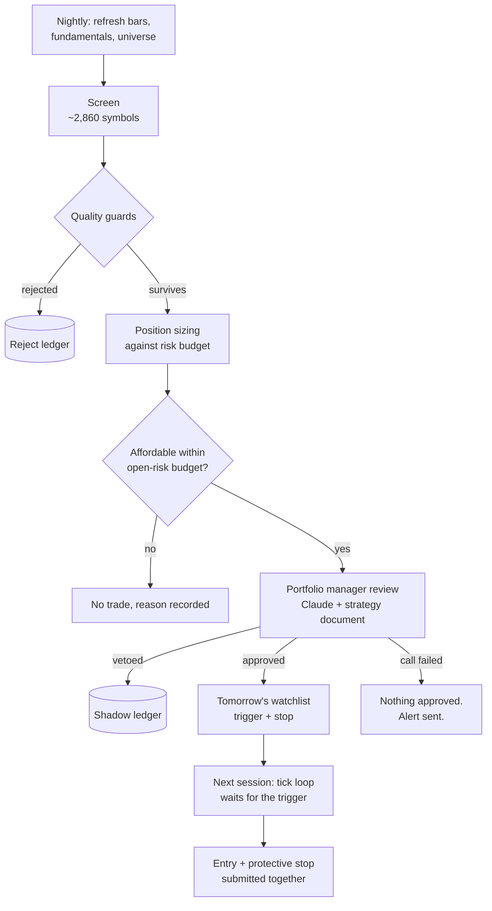

# Claudio

An autonomous equity trading system. It screens the US market nightly, sizes positions
against a written risk budget, submits orders to Charles Schwab with protective stops
attached, and reports what it did by email.

It runs unattended on a Mac mini. I built it to find out whether the things I was being
taught about position sizing and valuation survive contact with a live account.

---

## Status

| | |
|---|---|
| **Account A** | Live. Trades a momentum / value / bounce strategy. |
| **Account B** | Live. Trades a conservative trend-confirmed value strategy. |
| **Test suite** | 141 tests |
| **Universe** | ~2,860 US symbols, ~820,000 daily bars |

**I don't publish returns.** The live sample is small enough that any number I quoted
would be noise, and a reader would be right to distrust it. What's below is about how
the system decides, not how it has done.

---

## The daily cycle



Nothing is bought the same day it is found. The screen proposes at night, the review
gate judges, and the next session's tick loop only acts if price trades up through the
trigger. A thesis that was right on Friday and stale by Monday simply never fires.

---

## Design decisions that matter

### One codebase, two rulebooks

Both strategies run the same engine. A profile module overwrites the uppercase constants
in the rulebook at import, so `RISK_PER_TRADE`, the position caps, the enabled setups and
the screen parameters all change while the execution path stays identical.

```python
PROFILE = os.environ.get("CLAUDIO_PROFILE", "luck")
if PROFILE not in ("", "luck"):
    overlay = import_module(f"engine.profiles.{PROFILE}")
    for k in dir(overlay):
        if k.isupper() and not k.startswith("_"):
            globals()[k] = getattr(overlay, k)
```

This means a mandate is expressed as configuration rather than as a fork. The
conservative profile enables only the value setup, raises the minimum market cap from
$300M to $2B, requires three years of trading history, and adds five quality guards the
other profile doesn't apply. Same code, different account, different answers — and every
difference is one line you can point at.

### The account fence fails closed

Brokerage account access comes from an explicit environment grant, never from a default.
With no account granted, every Schwab call raises rather than falling back to a live
account. Trading is a second, separate gate: `TRADING_ENABLED` requires its own explicit
yes, so an engine can run, screen and report with no ability to place an order.

Running the engine by hand defaults to trading off. Only the scheduled job passes the
flag that enables it.

### Stops are submitted with the entry, not after it

Orders go to Schwab as `first_triggers_second`: the protective stop is a child of the
buy. There is no window in which a position exists without a stop behind it, including
if the machine dies between the two calls.

### The review gate is last, and it fails closed

The screen produces candidates and the risk framework sizes them. Only then does an LLM
see them, along with the strategy document as its system prompt, and approve or veto each
one with a written thesis and an invalidation condition.

Three things make it safe to put a language model in that seat:

1. **It can only veto or approve what it was shown.** Its reply is validated against the
   candidate list; a symbol it was never given is dropped before it can reach an order.
2. **A failed call approves nothing.** If the API errors, the run records the failure,
   emails an alert, and buys nothing. It never falls through to the raw screen output.
3. **It cannot change the risk budget.** Sizing happens before the review. The manager
   chooses among already-sized candidates and may only reduce.

Every approval is stored with its thesis and its invalidation, so months later you can
read why a position was opened and check whether the reason still holds.

---

## Risk framework

Sizing is fixed-fractional off a stated risk per trade rather than a percentage of
capital, so position size falls out of the stop distance:

```
qty = (equity × risk_per_trade) / (entry − stop)
```

then capped by, in order: maximum position size, sector exposure, settled cash, and the
total open-risk budget. The binding constraint is recorded with the trade, so you can see
*why* a position was the size it was.

On top of that:

- **Open-risk budget** — the sum of every position's distance to its stop is capped. A
  holding with no stop counts its entire value as risk, which makes unprotected positions
  expensive rather than invisible.
- **Daily loss halt** and **total drawdown halt** from the equity peak, both hard stops
  that no component can override.
- **Entry caps** per day and per month. Haste is the failure mode this account is most
  exposed to.
- **Earnings handling** — positions are not opened into an earnings date unless the
  profile explicitly allows holding through them.

---

## Measuring its own decisions

This is the part I'd most want someone to look at.

A screen that only records what it bought can never be evaluated. You see your winners
and losers, and nothing about the names you passed on — so a bad filter can quietly
reject good trades for a year and leave no evidence.

The system keeps two ledgers for that:

**The shadow ledger** records every candidate the portfolio manager was shown, what it
decided, its reason, and — scored later — what the price actually did. That grades the
reviewer.

**The reject ledger** records names the *screen* killed on a quality guard, with the
guard that fired and the value that tripped it. That grades the filter, which is
otherwise the one component nobody can audit.

Only the quality guards are logged. Most of a 2,860-symbol universe fails the basic
cheapness test every night, and "not cheap" isn't a claim worth testing. What gets kept
is a name that *was* cheap and growing and then failed on balance sheet, margin trend or
earnings quality — because that's an empirical claim about outcomes, and it should be
possible to find out if it was wrong.

---

## A worked example: a rule I didn't ship

The conservative account holds a large index position. I wanted to know whether it should
carry a trend-following exit — sell when the index closes below its 200-day average, buy
back when it recovers — instead of running unprotected.

I backtested it over eleven years of daily data, comparing four variants:

| Strategy | CAGR | Max drawdown | Round trips | Whipsaws |
|---|---|---|---|---|
| Buy and hold | 13.59% | −34.3% | 0 | 0 |
| Daily cross, 2% buffer | 11.08% | −16.4% | 13 | 12 |
| Monthly cross, no buffer | 10.06% | −19.2% | 8 | 7 |
| **Monthly cross, 2% buffer** | **10.39%** | **−13.9%** | **7** | 6 |

The monthly rule with an asymmetric re-entry buffer — free to exit, has to clear the
average by 2% to return — cut maximum drawdown by 60% for about two points of annual
return. Six of its seven round trips lost money; the one that paid was sitting out 2022.

Two things came out of this that I didn't expect.

**Static de-risking is worse.** To reach the same −14% drawdown by simply holding less
equity, the blended return would be around 8%. The rule gets there at 10.4%, so it's
roughly two points a year better than the obvious alternative.

**A separate guard I was confident about turned out to be wrong.** I had a rule rejecting
companies whose current ratio was below 1.0, and I argued it was unfair to miners, whose
working capital I assumed ran thin. I measured it: the materials sector has the
second-*highest* median current ratio of any sector (2.44), and the company I'd used as
my example sat in its 7th percentile. My reasoning was backwards, so the change didn't
ship.

The guard that *is* miscalibrated turned out to be a different one — a flat 1.0 threshold
excludes 65% of utilities and 40% of REITs, where sub-1.0 is structurally normal. That
one is queued behind having enough ledger data to decide it with evidence rather than
argument.

---

## Layout

```
engine/
  run.py         daemon loop, market-hours scheduling, crash recovery
  core.py        session logic: premarket, morning, tick, nightly
  setups.py      screens and their quality guards
  risk.py        sizing, caps, open-risk budget, exit signals
  rules.py       the rulebook, plus the profile overlay
  profiles/      per-account rulebook overrides
  analyst.py     LLM calls: review gate, legacy review, premarket
  data.py        Schwab market data
  db.py          SQLite: bars, universe, fundamentals, positions, journal
  backtest.py    strategy evaluation
  metrics.py     attribution, benchmark, execution quality
  broker.py      order construction and submission
schwab_api/      OAuth, client, account fencing
tests/           141 tests
```

---

## Running it

You need a Charles Schwab developer app (OAuth key and secret), an Anthropic API key for
the review gate, and Python 3.12.

```bash
git clone <repo> && cd claudio
python3.12 -m venv venv && venv/bin/pip install -r requirements.txt
cp secrets_local.example.py secrets_local.py     # your keys
cp config_local.example.py config_local.py       # your account, your alerts
venv/bin/python -m schwab_api.login --manual     # one-time OAuth
venv/bin/python -m engine.cashrun                # advisory run, places nothing
```

`secrets_local.py` and `config_local.py` are gitignored and have never been committed.
Trading stays off until it is explicitly enabled.

---

## Disclaimer

This software places real orders with real money. It is published because the
engineering and the reasoning may be useful to read, not as investment advice and not as
something I suggest anyone run against their own account. I am not a financial adviser.
Markets can and will do things no backtest contained. If you run it, you own the
consequences.

MIT licensed.
